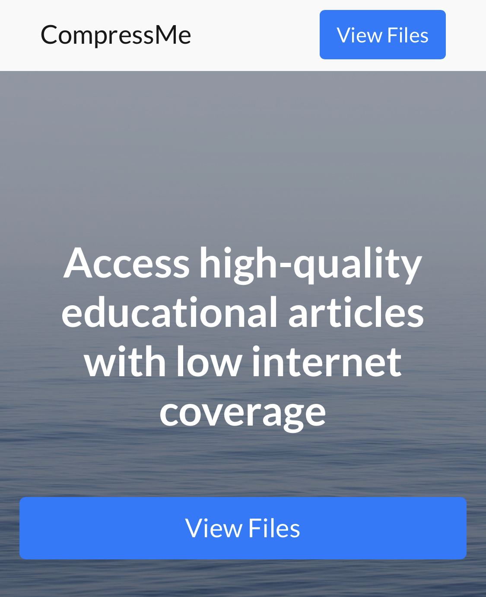

# CompressMe

Our project aims to provide people with intermittent internet connections, low internet speeds, or storage constraints a way to save the most relevant information they might need from a website to their devices for offline access in a light and portable format, with special consideration given to students requiring access to educational content despite unstable connectivity.
